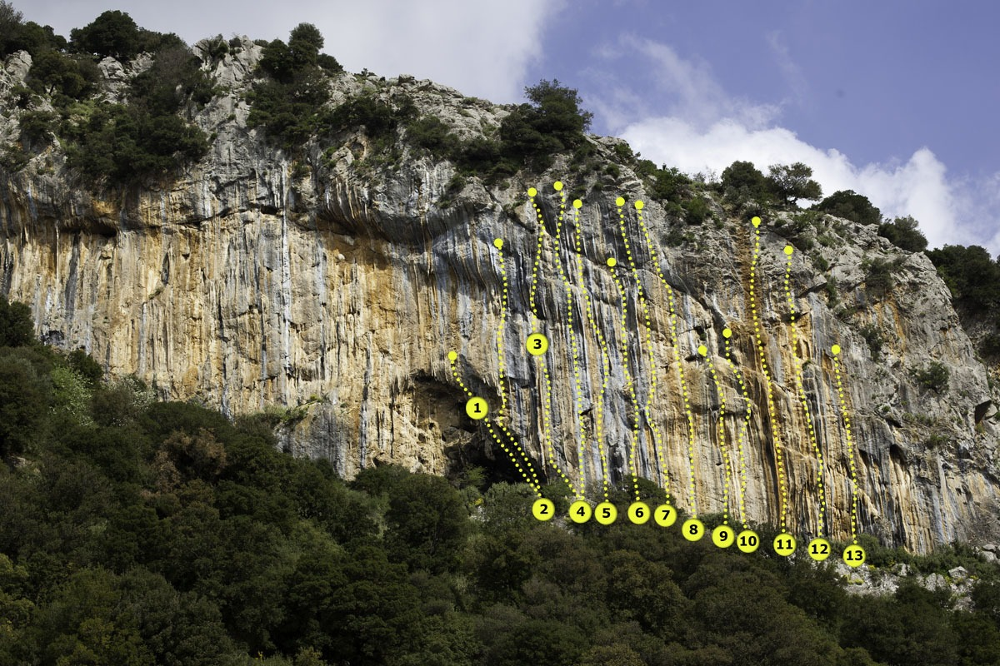

# Αλεποχώρι - Σπαρτιά

## Περιγραφή

Το Αλεποχώρι (ή Αλποχώρι) είναι ένα χωριουδάκι στους πρόποδες του Ερυμάνθου, σε υψόμετρο 530 μέτρων. Το όνομά του προέρχεται από το μυθικό βασιλιά Άλπη ή το γίγαντα Άλπο. Το πεδίο ανοίχτηκε το 1994, με πρώτες διαδρομές τη __Σταλακτιτική συνουσία__ (7c) και την __Πορνoγκραφί__ (7c+) από τον Γ. Τορέλλι και σταδιακά αναπτύχθηκε σε δημοφιλή αναρριχητικό προορισμό.

Υπάρχουν έξι τομείς στο Αλεποχώρι και ένας στη πολύ κοντινή Σπαρτιά:

1. [Σπηλιά](#sec:alepochori_spilia)
1. [Αλπεός](#sec:alepochori_alpeos)
1. [Δυτικό ζωνάρι - Κάτω](#sec:alepochori_dytiko_kato)
1. [Δυτικό ζωνάρι - Πάνω](#sec:alepochori_dytiko_pano)
1. [Ανατολικό ζωνάρι - Δεξιά](#sec:alepochori_anatoliko_dexia)
1. [Ανατολικό ζωνάρι - Αριστερά](#sec:alepochori_anatoliko_aristera)
1. [Σπαρτιά](#sec:spartia)

```{.matplotlib preamble=scripts/barchart14.py format=SVG caption="Αλεποχώρι. Αθροιστικό γράφημα όλων των διαθέσιμων βαθμολογιών." label=lstpreprocess}
y = np.array([1,0.1,5,1,10,7,7,5,5,7,3,10,9,5,13,10,9,5,4,0.1,0.1,0.1])

plt.bar(x, y, color=colors, width = 0.9)
plt.yticks([0,2,4,6,8,10,12])
ax = plt.gca()
for label in ax.xaxis.get_ticklabels()[1::2]:
    label.set_visible(False)
```

### Πρόσβαση

Το Αλεποχώρι απέχει 50 λεπτά από την Πάτρα. Ακολουθείτε την εθνική οδό 111 από Πάτρα προς Τρίπολη και στο 24ο χιλιόμετρο στρίβετε αριστερά προς Αλεποχώρι. Ακολουθείτε τον επαρχιακό δρόμο που καταλήγει στο Αλεποχώρι. Πριν φτάσετε στο χωριό συναντάτε τους τέσσερις πρώτους τομείς (τα δυτικά ζωνάρια βρίσκονται στα αριστερά του δρόμου, η σπηλιά πάνω στο δρόμο και ο Αλπεός δεξιά της σπηλιάς στο ποτάμι). Για το ανατολικό ζωνάρι, στη διασταύρωση ακριβώς πριν τη γέφυρα στην είσοδο του χωριού, στρίψτε αριστερά πάνω. Για τη σπηλιά της Σπαρτιάς περνάτε μέσα από το Αλεποχώρι. Δυο χιλιόμετρα μετά, στην έξοδο της Σπαρτιάς, συναντάτε τη σπηλιά στα αριστερά. Με δυο λεπτά περπάτημα βρίσκεστε στη σπηλιά.

[](https://www.google.com/maps/dir/%CE%A0%CE%AC%CF%84%CF%81%CE%B1/37.9875295,21.7940508/37.9918261,21.7982403/@38.1358949,21.6352526,11.46z/data=!4m10!4m9!1m5!1m1!1s0x135e3599a524ed2d:0x400bd2ce2b98ca0!2m2!1d21.734574!2d38.2466395!1m0!1m0!3e0?entry=ttu)

### Συνθήκες
<div class="conditions">

Το Αλεποχώρι έχει τομείς για όλα τα επίπεδα αναρριχητών. Περιλαμβάνει δυσκολίες από 5c ως 8a+. Τα δυτικά ζωνάρια σκαρφαλώνονται από τον Οκτώβριο ως τον Απρίλιο, ειδικά τις ηλιόλουστες μέρες του χειμώνα. Τα ανατολικά ζωνάρια αντίστοιχα είναι φιλόξενα από την άνοιξη ως το φθινόπωρο.

<div class="meteoblue">

<iframe src="https://www.meteoblue.com/el/%CE%BA%CE%B1%CE%B9%CF%81%CF%8C%CF%82/widget/daily/%ce%a4%cf%83%ce%bf%cf%8d%ce%ba%ce%b1_%ce%95%ce%bb%ce%bb%ce%ac%ce%b4%ce%b1_252431?geoloc=fixed&days=4&tempunit=CELSIUS&windunit=KILOMETER_PER_HOUR&precipunit=MILLIMETER&coloured=coloured&pictoicon=0&pictoicon=1&maxtemperature=0&maxtemperature=1&mintemperature=0&mintemperature=1&windspeed=0&windspeed=1&windgust=0&winddirection=0&winddirection=1&uv=0&humidity=0&humidity=1&precipitation=0&precipitation=1&precipitationprobability=0&precipitationprobability=1&spot=0&pressure=0&layout=light"  frameborder="0" scrolling="NO" allowtransparency="true" sandbox="allow-same-origin allow-scripts allow-popups allow-popups-to-escape-sandbox" style="width: 216px; height: 320px"></iframe><div><!-- DO NOT REMOVE THIS LINK --><a href="https://www.meteoblue.com/el/%CE%BA%CE%B1%CE%B9%CF%81%CF%8C%CF%82/%CE%B5%CE%B2%CE%B4%CE%BF%CE%BC%CE%AC%CE%B4%CE%B1/%ce%a4%cf%83%ce%bf%cf%8d%ce%ba%ce%b1_%ce%95%ce%bb%ce%bb%ce%ac%ce%b4%ce%b1_252431?utm_source=weather_widget&utm_medium=linkus&utm_content=daily&utm_campaign=Weather%2BWidget" target="_blank" rel="noopener">meteoblue</a></div>

</div>
</div>

## Σπηλιά {#sec:alepochori_spilia}

Η σπηλιά βρίσκεται ακριβώς πάνω στο δρόμο όπου μπορούμε να παρκάρουμε για να πάμε και στα διπλανά πεδία, [Αλπεός](@sec:alepochori_alpeos), και Δυτικό ζωνάρι [κάτω](@sec:alepochori_dytiko_kato) και [πάνω](@sec:alepochori_dytiko_pano). Ανάλογα με την εποχή οι ντόπιοι κτηνοτρόφοι χρησιμοποιούν τη σπηλιά για να αποθηκεύσουν χορτάρι.

|    | Όνομα               | Βαθμός | Ύψ. | Ανοίχτηκε από   |
| -- | ------------------- | ------ | --- | ---------- |
| 1. | Η χειρότερη         | 7a+    | 30μ | Ποταμούσης |
| 2. | Βασιλιάς της σκόνης | 6c/6c+ | 30μ | Τορέλλι    |
| 3. | Δαίμονας            | 8a/8a+ | 25μ | Τορέλλι    |
| 4. | Σαμψών              | 8a+    | 20μ | Τορέλλι    |
| 5. | Βρυκόλακας          | 8a     | 20μ | Τορέλλι    |
| 6. | Ψόφιο αρνί          | 8a+    | 25μ | Τορέλλι    |

```{.matplotlib preamble=scripts/barchart4.py format=SVG caption="Αλεποχώρι - Σπηλιά. Αθροιστικό γράφημα όλων των διαθέσιμων βαθμολογιών."}
y = np.array([0.1,0.1,0.1,0.1,0.1,0.1,1,0.1,0.1,1,0.1,0.1,0.1,0.1,2,2,0.1,0.1,0.1,0.1])

plt.bar(x, y, color=colors, width = 0.9)
plt.yticks([0,2,4])
ax = plt.gca()
for label in ax.xaxis.get_ticklabels()[1::2]:
    label.set_visible(False)
```

## Αλπεός  {#sec:alepochori_alpeos}

Απέναντι από τη σπηλιά, περνώντας το ποτάμι βρίσκονται οι αναρριχητικές διαδρομές του Αλπεού. 

|     | Όνομα             | Βαθμός | Ύψ. | Ανοίχτηκε από  |
| --- | ----------------- | ------ | --- | --------- |
| 1.  | Πρίσμα            | 6a     | 20μ | Τορέλλι   |
| 2.  | Εσπρεσίλακας      | 6a+    | 20μ | Τορέλλι   |
| 3.  | Κόμπρα            | 6c     | 20μ | Τορέλλι   |
| 4.  | Χιμπατζής         | 7b     | 25μ | Τορέλλι   |
| 5.  | Ψοφίμι            | 7b+    | 25μ | Τορέλλι   |
| 6.  | Στήλη άλατος      | 7a+    | 28μ | Τορέλλι   |
| 7.  | Αλπεός            | 7c+    | 28μ | Τορέλλι   |
| 8.  | Ηρακλής           | 7b+    | 28μ | Τορέλλι   |
| 9.  | Ερυμάνθιος κάπρος | 7a+    | 28μ | Τορέλλι   |
| 10. | Σαύρα             | 6c+    | 30μ | Τορέλλι   |
| 11. | Πύθωνας           | 7c     | 25μ | Τορέλλι   |
| 12. | Πρεμιέρα          | 7a+    | 25μ | Ξ. Παλιός |

```{.matplotlib preamble=scripts/barchart4.py format=SVG caption="Αλπεός. Αθροιστικό γράφημα όλων των διαθέσιμων βαθμολογιών."}
y = np.array([0.1,0.1,1,1,0.1,0.1,1,1,0.1,3,1,2,1,1,0.1,0.1,0.1,0.1,0.1,0.1])

plt.bar(x, y, color=colors, width = 0.9)
plt.yticks([0,2,4])
ax = plt.gca()
for label in ax.xaxis.get_ticklabels()[1::2]:
    label.set_visible(False)
```

## Δυτικό ζωνάρι - Κάτω {#sec:alepochori_dytiko_kato}

Λίγο πριν τη σπηλιά, στα αριστερά φαίνεται ανηφορίζει από την άσφαλτο ένας κακός χωματόδρομος που φράσσεται από ένα μεταλλικό πλέγμα. Ανεβαίνουμε με τα πόδια για λίγες δεκάδες μέτρα και έπειτα στρίβουμε αριστερά. Ακόμη και αν δεν βρούμε μονοπάτι, το πεδίο είναι πολύ κοντά και εύκολα προσβάσιμο. Έχει μερικές από τις πιο ιστορικές και εντυπωσιακές διαδρομές του πεδίου. Ενδείκνυται για σκαφάλωμα στον χειμωνιάτικο ήλιο. Όταν όμως ζεστάνει ο καιρός, το σκαρφάλωμα είναι δυνατό μόνο το πρωί.

::: note
Δυστυχώς τον τελευταίο καιρό κάποιος βοσκός έχει φράξει την πρόσβαση στη σπηλιά.
:::

|     | Όνομα                 | Βαθμός | Ύψ. | Ανοίχτηκε από            |
| --- | --------------------- | ------ | --- | ------------------- |
| 1.  | Οργόνη                | 7c     | 20μ | Θανόπουλος          |
| 2.  | The Final Papar       | 6b+    | 20μ | Θανόπουλος          |
| 3.  | Φεγγαρόπετρα          | 6c+    | 30μ | Τορέλλι             |
| 4.  | Τραγοπόδαρος          | 6c+    | 22μ | Τορέλλι             |
| 5.  | Λύτρωση               | 7c     | 28μ | Τορέλλι             |
| 6.  | Λείψανο               | 7c     | 28μ | Τορέλλι             |
| 7.  | Σταχτερή              | 7b+/7c | 28μ | Τορέλλι             |
| 8.  | Σβαρνίστρα            | 7a+/7b | 30μ | Τορέλλι             |
| 9.  | Ερμής                 | 7c     | 28μ | Τορέλλι             |
| 10. | Χρυσαφένια            | 7c+    | 30μ | Θανόπουλος          |
| 11. | Χρυσαλλίδα            | 8a     | 30μ | Τορέλλι             |
| 12. | Turbo booster         | 7c+    | 25μ | Θανόπουλος          |
| 13. | Σταλακτιτική συνουσία | 7c     | 30μ | Τορέλλι             |
| 14. | Πορνoγκραφί           | 7c+    | 35μ | Τορέλλι             |
| 15. | Παίξε γέλασε          | 7b+    | 30μ | Τορέλλι             |
| 16. | Στύγα                 | 8a     | 12μ | Τορέλλι             |
| 17. | Βεελζεβούλ            | 7b+    | 12μ | Θανόπουλος          |
| 18. | Πιθηκάνθρωπος         | 7b+    | 15μ | Θανόπουλος          |
| 19. | Αίθων                 | 7b+    | 30μ | Τορέλλι             |
| 20. | Prohibition           | 7c+    | 30μ | Θανόπουλος          |
| 21. | Τεθρέας               | 7c+    | 40μ | Τορέλλι             |
|     |                       | 7c     | 37μ | Θανόπουλος          |
| 22. | Αγριώπη               | 7a+/7b | 15μ | Τορέλλι             |
| 23. | Γκουρού               | 8a+    | 13μ | Τορέλλι             |
| 24. | Σκνίπα                | 8a     | 13μ | Τορέλλι             |
| 25. | Σκούμπυ Ντου          | 7c+    | 13μ | Τορέλλι             |
| 26. | Μαραμπού              | ?      | 13μ | Θανόπουλος          |
| 27. | Νυφίτσα               | 7b+    | 10μ | Τορέλλι             |
| 28. | Κουκουρούκου          | 8a+    | 10μ | Τορέλλι, Θανόπουλος |
| 29. | Αστραπή               | 7c/+   | 10μ | Τορέλλι             |
| 30. | Βίτσιο                |        | 40μ |                     |
|     | 1η σχοινιά            | 6a+    |     | Τορέλλι             |
|     | 2η σχοινιά            | 6c     |     | Τορέλλι             |
| 31. | Μάρκο Πόλο            |        | 35μ |                     |
|     | 1η σχοινιά            | 6a     |     | Θανόπουλος          |
|     | 2η σχοινιά            | 7a     |     | Θανόπουλος          |
| 32. | Φωλιά του αετού       |        | 60μ |                     |
|     | 1η σχοινιά            | 6a+    |     | Θανόπουλος          |
|     | 2η σχοινιά            | 6b     |     | Θανόπουλος          |
|     | 3η σχοινιά            | 6c     |     | Θανόπουλος          |
| 33. | Super mini            | 7a+    | 12μ | Θανόπουλος          |
| 34. | Μέγας Αλέξανδρος      | ?      |     | Θανόπουλος          |

```{.matplotlib preamble=scripts/barchart8.py format=SVG caption="Δυτικό ζωνάρι - Κάτω. Αθροιστικό γράφημα όλων των διαθέσιμων βαθμολογιών." }
y = np.array([0.1,0.1,1,2,1,1,3,1,1,3,0.1,6,6,5,2,2,0.1,0.1,0.1,0.1])

plt.bar(x, y, color=colors, width = 0.9)
plt.yticks([0,2,4,6,8])
ax = plt.gca()
for label in ax.xaxis.get_ticklabels()[1::2]:
    label.set_visible(False)
```

## Δυτικό ζωνάρι - Πάνω {#sec:alepochori_dytiko_pano}

Το πάνω ζωνάρι είναι το πιο νέο το Αλεποχωρίου. Βρίσκεται περίπου δέκα λεπτά πιο πάνω από το κάτω ζωνάρι.

{width=100%}

|     | Όνομα                     | Βαθμός | Ύψ. | Ανοίχτηκε από           |
| --- | ------------------------- | ------ | --- | ------------------ |
| 1.  | Μαύρη μαγεία              | 7c     | 20μ |                    |
| 2.  | Πίσσα και Πούπουλα        | 7b+    | 30μ | Θανόπουλος/Τορέλλι |
| 3.  | Belladona                 | 7b     | 35μ | Τορέλλι            |
| 4.  | Yerba Mate                | 7c     | 35μ | Σωτηρόπουλος       |
| 5.  | Marijuana                 | 8a     | 35μ | Σωτηρόπουλος       |
| 6.  | Crataegus                 | 7c+    | 30μ | Σωτηρόπουλος       |
| 7.  | Marijuana στοπ            | 7b+    | 35μ | Τορέλλι            |
| 8.  | Πρότζεκτ                  |        | 35μ | Σωτηρόπουλος       |
| 9.  | Πάνας                     | 7c+    | 20μ | Τορέλλι            |
| 10. | Θείο τραγί                | 7a+    | 25μ | Τορέλλι            |
| 11. | Μανδραγόρας               | 7b+    | 35μ | Θανόπουλος         |
| 12. | Γυναίκα, μπικίνι, τραγικό | 7b     | 35μ | Τορέλλι            |
| 13. | Φλωμίς                    | 7b     | 25μ | Τορέλλι            |

```{.matplotlib preamble=scripts/barchart4.py format=SVG caption="Δυτικό ζωνάρι - Πάνω. Αθροιστικό γράφημα όλων των διαθέσιμων βαθμολογιών."}
y = np.array([0.1,0.1,0.1,0.1,0.1,0.1,0.1,0.1,0.1,1,3,3,2,2,1,0.1,0.1,0.1,0.1,0.1])

plt.bar(x, y, color=colors, width = 0.9)
plt.yticks([0,2,4])
ax = plt.gca()
for label in ax.xaxis.get_ticklabels()[1::2]:
    label.set_visible(False)
```

## Ανατολικό ζωνάρι - Δεξιά  {#sec:alepochori_anatoliko_dexia}

Το ανατολικό ζωνάρι είναι αρκετά δημοφιλές για τα απογεύματα του καλοκαιριού, όταν μπαίνει στη σκιά. Έχει μια σειρά από εύκολες διαδρομές γύρω στο 5c-6b+ και προσελκύει και νέους ή πιο ευκαιριακούς αναρριχητές. Στις διαδρομές αυτές ο βράχος είναι κάπως κοφτερός, εξού και τα χαρακτηριστικά ονόματα "Βελονοφοβία", "Τσίμπημα", "Δάγκωμα" κλπ.

Αφού περάσουμε τη σπηλιά, καθώς πλησιάζουμε στο Αλεποχώρι, συναντούμε μια γέφυρα που πηγαίνει δεξιά πάνω από το ποτάμι. Εκεί, πριν τη γέφυρα, στρίβουμε δεξιά και παίρνουμε τον ανηφορικό δρόμο. Στα πρώτα μέτρα έχει τσιμέντο, αλλά έπειτα γίνεται βατός χωματόδρομος. Μετά από μερικές στροφές, παρκάρουμε σε ένα χαρακτηριστό πλάτωμα μιας δεξιάς φουρκέτας που χωράει 4-5 αυτοκίνητα. Από το πάρκινγκ το μονοπάτι θα πρέπει να είναι εμφανές ανάμεσα στους κατσικόδρομους, καθώς έχει πρόσφατα σημειωθεί με κόκκινη μπογιά. Περπατάμε χωρίς να κερδίζουμε ιδιαίτερο ύψος και μετά από 3-4 λεπτά βρισκόμαστε στο πεδίο.

|     | Όνομα                         | Βαθμός | Ύψ. | Ανοίχτηκε από               |
| --- | ----------------------------- | ------ | --- | ---------------------- |
| 1.  | Κοντή                         | 7a+    | 10μ | Τορέλλι                |
| 2.  | Αγρια μέντα                   | 7c     | 20μ | Τορέλλι                |
| 3.  | Προδότης                      | 7c     | 20μ | Τορέλλι                |
| 4.  | Δέρμα φιδιού                  | 7a+/b  | 22μ | Τορέλλι                |
| 5.  | Μητσόγκονας                   | 6b     | 20μ | Τορέλλι                |
| 6.  | Αρχιεπίσκοπος                 | 6b+    | 20μ | Τορέλλι                |
| 7.  | Σακοράφα                      | 6b     | 15μ | Τορέλλι                |
| 8.  | ?                             | 6c     | 20μ | Καρύμπαλης             |
| 9.  | Γής μαδιάμ                    | 6a     | 20μ | Φραγκουλιας/Καρύμπαλης |
| 10. | Ούρτ!                         | 6b+    | 20μ | Τορέλλι                |
| 11. | Πυθαγόρειο Θεώρημα            | 6b+    | 20μ | Θανόπουλος             |
| 12. | Λεπιδόπτερα                   | 7c+/8a | 20μ | Θανόπουλος             |
| 13. | Εxtremista                    | 7c+/8a | 20μ | Θανόπουλος             |
| 14. | Born slippy                   | 7b     | 25μ | Θανόπουλος             |
| 15. | Αραχνοπόδαρος                 | 6c+    | 20μ | Τορέλλι                |
| 16. | Μπαρμπα-Ντίνος                | 7a     | 20μ | Θανόπουλος             |
| 17. | Καλή θέα                      | 6a+    | 20μ | Πιλάλης                |
| 18. | Cuore Sportivo                | 6a+    | 20μ | Κινατίδης              |
| 19. | Βελονισμός                    | 5c     | 20μ | Τορέλλι                |
| 20. | Βελονοθήκη                    | 6a+    | 15μ | Τορέλλι                |
| 21. | Βελονοφοβία                   | 6a     | 15μ | Τορέλλι                |
| 22. | Τσίμπημα                      | 5c     | 15μ | Τορέλλι                |
| 23. | Δάγκωμα                       | 5c     | 15μ | Τορέλλι                |
| 24. | Η ψηλή                        | 6c+    | 30μ | Θανόπουλος             |
| 25. | Ο ψηλέας με το ακούρευτο μαλί | 6b+    | 30μ | Τορέλλι                |

```{.matplotlib preamble=scripts/barchart6.py format=SVG caption="Ανατολικό ζωνάρι - Δεξιά. Αθροιστικό γράφημα όλων των διαθέσιμων βαθμολογιών."}
y = np.array([0.1,3,2,3,2,4,1,2,1,2,1,0.1,2,1,0.1,0.1,0.1,0.1,0.1,0.1])

plt.bar(x, y, color=colors, width = 0.9)
plt.yticks([0,2,4,6])
ax = plt.gca()
for label in ax.xaxis.get_ticklabels()[1::2]:
    label.set_visible(False)
```

## Ανατολικό ζωνάρι - Αριστερά  {#sec:alepochori_anatoliko_aristera}

Το ανατολικό αριστερό ζωνάρι έχει πολύ καλό βράχο, λιγότερο κοφτερό από το πάνω, αλλά πιο περιπετειώδες σκαρφάλωμα, και με run out. Μάλλον όλες οι διαδρομές είναι πιο δύσκολες απ'ότι είχαν αρχικά δοθεί. Οι ασφάλειες είναι παλιές (κυρίως Aegean) αλλά είναι αξιόπιστες και οι περισσότερες σε πολύ καλή κατάσταση. Σκαρφαλώνεται πολύ πιο σπάνια από ό,τι το δεξί ζωνάρι. Για να φτάσουμε στις διαδρομές συνεχίζουμε το περπάτημα από το δεξί ζωνάρι.

|     | Όνομα             | Βαθμός | Ύψ. | Ανοίχτηκε από |
| --- | ----------------- | ------ | --- | -------- |
| 1.  | Νεκροθάφτης       | 7a+    | 25μ | Τορέλλι  |
| 2.  | Μαγκούφης         | 6a+    | 20μ | Τορέλλι  |
| 3.  | Σαπίλα            | 6b+    | 25μ | Τορέλλι  |
| 4.  | Ο κουμπάρος       | 6a     | 25μ | Τορέλλι  |
| 5.  | Κοκκαλιάρης       | 5c     | 25μ | Τορέλλι  |
| 6.  | Mr. Bean          | 6b     | 20μ | Τορέλλι  |
| 7.  | Ροχάλα            | 6a     | 20μ | Τορέλλι  |
| 8.  | Τρύπα             | 6c     | 20μ | Τορέλλι  |
| 9.  | Βραχοτσοπανάκος   | 6b     | 25μ | Τορέλλι  |
| 10. | Γορίλας           | 5b     | 18μ | Τορέλλι  |
| 11. | Φάντασμα          | 6a     | 18μ | Τορέλλι  |
| 12. | Νάνος             | 5c     | 18μ | Τορέλλι  |
| 13. | Σχισμή του κισσού | 6a     | 25μ |          |

```{.matplotlib preamble=scripts/barchart6.py format=SVG caption="Ανατολικό ζωνάρι - Αριστερά. Αθροιστικό γράφημα όλων των διαθέσιμων βαθμολογιών."}
y = np.array([1,2,4,2,2,1.05,1,0.1,0.1,1,0.1,0.1,0.1,0.1,0.1,0.1,0.1,0.1,0.1,0.1])

plt.bar(x, y, color=colors, width = 0.9)
plt.yticks([0,2,4,6])
ax = plt.gca()
for label in ax.xaxis.get_ticklabels()[1::2]:
    label.set_visible(False)
```

## Σπαρτιά  {#sec:spartia}

Η μικρή σπηλιά αμέσως μετά τη Σπαρτιά έχει μερικές εντυπωσιακές διαδρομές. Η σπηλιά βρίσκεται ακριβώς στην έξοδο του χωριού, στα αριστερά όπως ερχόμαστε από το Αλεποχώρι.

|     | Όνομα           | Βαθμός | Ύψ. | Ανοίχτηκε από |
| --- | --------------- | ------ | --- | -------- |
| 1.  | ?               |        |     |          |
| 2.  | Μικρός σκορπιός | 6c+    |     |          |
| 3.  | Κουκουβάγια     | 7c     |     |          |
| 4.  | Καλικάντζαρος   | 7a+    |     |          |
| 5.  | Κάμπια          | 8b     |     |          |
| 6.  | Κοράκι          | 8a     |     |          |
| 7.  | Γύπας           | 8b     |     |          |
| 8.  | Κόνδορας        | 8a+(?) |     |          |
| 9.  | Πραξικόπημα     | 7c/7c+ |     |          |
| 10. | Έκτη αίσθηση    | 7b+    |     |          |
| 11. | Σκυλοδόντης     | 7b     |     |          |

```{.matplotlib preamble=scripts/barchart4.py format=SVG caption="Σπαρτιά. Αθροιστικό γράφημα όλων των διαθέσιμων βαθμολογιών."}
y = np.array([0.1,0.1,0.1,0.1,0.1,0.1,0.1,1,1,1,0,1,2,0.1,1,1,2,0.1,0.1,0.1])

plt.bar(x, y, color=colors, width = 0.9)
plt.yticks([0,2,4])
ax = plt.gca()
for label in ax.xaxis.get_ticklabels()[1::2]:
    label.set_visible(False)
```
