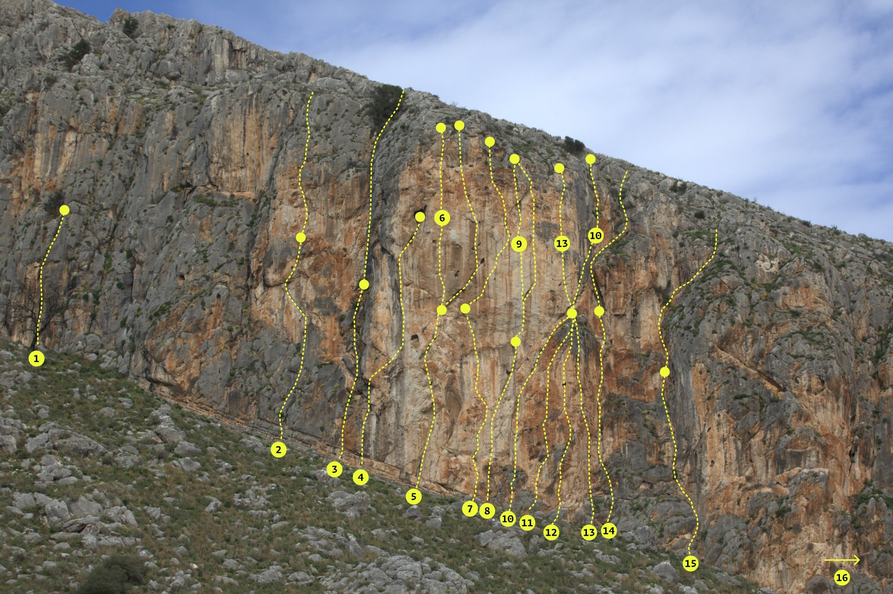

# Καλόγρια
<!-- 111 -->

{width=100%}  

## Περιγραφή

Στην περιοχή της Kαλόγριας αναπτύχθηκαν τα πρώτα αναρριχητικά πεδία στην περιοχή της Πάτρας. Βρίσκεται στο νότιο άκρο των Μαύρων Βουνών. Δίπλα από τα πεδία είναι η λιμνοθάλασσα του Προκόπου και στο βάθος το δάσος της Στροφιλιάς, τμήματα ενός εθνικού πάρκου 22.000 στρεμμάτων που προστατεύεται από διεθνείς συνθήκες.

Στην Καλόγρια υπάρχουν πάνω από 80 διαδρομές, οι περισσότερες από τις οποίες είναι αθλητικές. Υπάρχουν όμως και παραδοσιακές διαδρομές με δύο σχοινιές και βαθμολογίες μέχρι 7a. Η Καλόγρια έχει ιδιαίτερη σημασία για την ιστορία της ελληνικής αναρρίχησης. Αρκετές βαθμολογίες έγιναν για πρώτη φορά εδώ στην Ελλάδα.

Υπάρχει αρκετή ποικιλία στο σκαρφάλωμα και μεγάλο εύρος δυσκολιών ανάλογα με το πεδίο. Ο βράχος έχει γενικά καλή ποιότητα. Το σκαρφάλωμα γίνεται σε θετικό, κάθετο αλλά και αρνητικό βράχο. Στην Καλόγρια υπάρχει πολύ εύκολο σκαρφάλωμα στις εκπαιδευτικές διαδρομές του «Σχολείου».

{width=100%}  

Υπάρχουν 8 τομείς

1. [Στροφιλιά - Μεγάλος Τοίχος](#sec:kalogria_meg_toixos)
2. [Στροφιλιά - Κεντρικό](#sec:kalogria_kentriko)
3. [Στροφιλιά - «Γαλάζιο Όνειρο»](#sec:kalogria_galazio_oneiro)
4. [Παναγιά](#sec:kalogria_panagia)
5. [Σπηλιά των τεράτων](#sec:kalogria_spilia_ton_teraton)
6. [Σχολείο (εκπαιδευτικά)](#sec:kalogria_sxoleio)
7. [Πρόκοπος αριστερά - «Ουρλιαχτό»](#sec:kalogria_ourliaxto)
8. [Πρόκοπος δεξιά - «Σπάδωνες»](#sec:kalogria_spadones)
9. [Αυστριακών](#sec:kalogria_austriakon)

```{.matplotlib preamble=scripts/barchart14.py format=SVG caption="Καλόγρια. Αθροιστικό γράφημα όλων των διαθέσιμων βαθμολογιών." label=lstpreprocess}
y = np.array([16,1,3,0.1,8,6,3,6,3,2,3,3,1,9,4,9,5,4,2,1,0.1,0.1])

plt.bar(x, y, color=colors, width = 0.9)
plt.yticks([0,2,4,6,8,10,12,14,16])
ax = plt.gca()
for label in ax.xaxis.get_ticklabels()[1::2]:
    label.set_visible(False)
```
## Πρόσβαση

Από την Πάτρα το πεδίο απέχει 45 λεπτά. Από την Εθνική Οδό Πατρών - Πύργου στρίβετε δεξιά στο 26ο χιλιόμετρο στην Κάτω Αχαΐα και έπειτα ακολουθείτε το δρόμο προς την παραλία της Καλόγριας, προσπερνώντας τον Άραξο. Το πεδίο είναι στα δεξιά καθώς πλησιάζετε από τον Άραξο προς την παραλία της Καλόγριας.

[](https://www.google.gr/maps/dir/%CE%A0%CE%AC%CF%84%CF%81%CE%B1/38.1594337,21.3939085/@38.2517358,21.5283384,11z/data=!4m14!4m13!1m10!1m1!1s0x135e3599a524ed2d:0x400bd2ce2b98ca0!2m2!1d21.734574!2d38.2466395!3m4!1m2!1d21.5516996!2d38.14529!3s0x135e3c8dcecad341:0x1cf6ed92ce9843eb!1m0!3e0?hl=el)

## Συνθήκες
<div class="conditions">

Η Καλόγρια έχει νότιο προσανατολισμό. Η καλύτερη περίοδος για αναρρίχηση είναι το χειμώνα, από τα τέλη Οκτωβρίου μέχρι τον Μάρτιο. Το καλοκαίρι μόνο στον τομέα «Παναγία» έχει σκιά, μετά τις 16:00, αλλά η ζέστη είναι απαγορευτική. 

<div class="meteoblue">

<iframe src="https://www.meteoblue.com/el/%CE%BA%CE%B1%CE%B9%CF%81%CF%8C%CF%82/widget/daily/%ce%86%cf%81%ce%b1%ce%be%ce%bf%cf%82_%ce%95%ce%bb%ce%bb%ce%ac%ce%b4%ce%b1_264694?geoloc=fixed&days=4&tempunit=CELSIUS&windunit=KILOMETER_PER_HOUR&precipunit=MILLIMETER&coloured=coloured&pictoicon=0&pictoicon=1&maxtemperature=0&maxtemperature=1&mintemperature=0&mintemperature=1&windspeed=0&windspeed=1&windgust=0&winddirection=0&winddirection=1&uv=0&humidity=0&humidity=1&precipitation=0&precipitation=1&precipitationprobability=0&precipitationprobability=1&spot=0&pressure=0&layout=light"  frameborder="0" scrolling="NO" allowtransparency="true" sandbox="allow-same-origin allow-scripts allow-popups allow-popups-to-escape-sandbox" style="width: 216px; height: 320px"></iframe><div><!-- DO NOT REMOVE THIS LINK --><a href="https://www.meteoblue.com/el/%CE%BA%CE%B1%CE%B9%CF%81%CF%8C%CF%82/%CE%B5%CE%B2%CE%B4%CE%BF%CE%BC%CE%AC%CE%B4%CE%B1/%ce%86%cf%81%ce%b1%ce%be%ce%bf%cf%82_%ce%95%ce%bb%ce%bb%ce%ac%ce%b4%ce%b1_264694?utm_source=weather_widget&utm_medium=linkus&utm_content=daily&utm_campaign=Weather%2BWidget" target="_blank" rel="noopener">meteoblue</a></div>

</div>
</div>

## Στροφιλιά - Μεγάλος Τοίχος  {#sec:kalogria_meg_toixos}



|    |  Όνομα          | Βαθμός | Ύψ. | Χαράκτης  | Παρατηρήσεις
| - | ------ | - | - | -- | ----- |
| 1. | Ρωγμή           | VIII | 28μ |    Τορέλλι | Φυσικές ασφάλειες μόνο, hand crack
| 2. | Ανώνυμη         |      |     |    |
|    |   1η σχοινιά    | VII+ | 25μ |    Τορέλλι |
|    |   2η σχοινιά    | VII+ | 35μ |    Τορέλλι | 
| 3. | Καρούμπαλος     |      |     |    |
|    |   1η σχοινιά    | VI-  | 25μ |    Τορέλλι | 
|    |   2η σχοινιά    | VI+  | 35μ |    Τορέλλι | 
| 4. | Άτλαντας        | 7a   | 40μ |    Τορέλλι | 
| 5. | Αίολος          |      |     |    | | 
|    |   1η σχοινιά    | 7a   | 35μ |    Τορέλλι | Προσοχή στη 2η ασφάλεια
|    |   2η σχοινιά    | 7c+  | 35μ |    Τορέλλι | 
| 6.| Ασκός του Αιόλου| 7c   | 35μ |    Τορέλλι | 
| 7. | Σίσυφος         |      | 50μ |    |
|    |   1η σχοινιά    | 7b  |     |    Τορέλλι | 
|    |   2η σχοινιά    | 7c  |     |    Τορέλλι | 
| 8. | Αυγό του φιδιού |      | 50μ |
|    |   1η σχοινιά    | 6a   |     |    Θανόπουλος | 
|    |   2η σχοινιά    | 7b+  |     |    Θανόπουλος | 
| 9. | Λευκή μαγεία    | 8a+  | 35μ |    Θανόπουλος | 2η σχοινιά,με πρόσβαση από Περσεφόνη σκαρφαλώνεται και σε μια 70μ.
| 10. | Περσεφόνη       |      |     |    | 
|    |   1η σχοινιά    | VI-  | 35μ |    Θανόπουλος | Εχουν μπει πλακέτες μετά το άνοιγμα 
|    |   2η σχοινιά    | VII+ | 35μ |    Θανόπουλος | 
| 11.| Πυθέας          | VIII | 25μ |    Τορέλλι | 
| 12.| Ποσειδώνας      | 7b+  | 35μ |    Θανόπουλος | 
| 13.| Ήφαιστος        |      |     |    | | 
|    |   1η σχοινιά    | 7b+  | 30μ |    Τορέλλι | 
|    |   2η σχοινιά    | 7b   | 30μ |    Τορέλλι | 
| 14.| Φαραώ           |      |     |    | | 
|    |   1η σχοινιά    | VI-  | 30μ |    Μπουγιουκλού, Τορέλλι | 
|    |   2η σχοινιά    | VI   | 30μ |    Μπουγιουκλού, Τορέλλι | 
| 15.| Σαλώμη          |      |     |    | | 
|    |   1η σχοινιά    | VI-  | 30μ |    Καραβέλας, Χατζηγεωργίου | 
|    |   2η σχοινιά    | VI   | 30μ |    Καραβέλας, Χατζηγεωργίου | 
| 16.| Φέρετρο         |      | 60μ |    | | 
|    |   1η σχοινιά    | V    |     |    Τορέλλι | 
|    |   2η σχοινιά    | VIII-|     |    Τορέλλι | 

```{.matplotlib preamble=scripts/barchart6.py format=SVG caption="Στροφιλιά - Μεγάλος Τοίχος. Αθροιστικό γράφημα των διαθέσιμων βαθμολογιών." label=lstpreprocess}
y = np.array([0.1,0.1,1,0.1,0.1,0.1,0.1,0.1,1,1,0.1,4,1,1,0.1,0.1,0.1,0.1,0.1,0.1])

plt.bar(x, y, color=colors, width = 0.9)
plt.yticks([0,2,4,6])
ax = plt.gca()
for label in ax.xaxis.get_ticklabels()[1::2]:
    label.set_visible(False)
```

## Στροφιλιά - Κεντρικό {#sec:kalogria_kentriko}

|    |  Όνομα          | Βαθμός | Ύψ. | Χαράκτης  | Παρατηρήσεις
| - | ------ | - | - | -- | ----- |
| 1. | Συμπόσιο      | VI+   | 60μ | Θεοδωρόπουλος, Mπουγιούκος
| 2. | Φέρετρο       |       | 60μ | (ασφ. 0/3)
|    |   1η σχοινιά  | V     |     | Τορέλλι
|    |   2η σχοινιά  | VIII- |     | Τορέλλι
| 3. | Χλωμό φεγγάρι |       | 60μ | (ασφ. 0/3)
|    |   1η σχοινιά  | V+    |     | Τορέλλι, Θανόπουλος
|    |   2η σχοινιά  | VII+  |     | Τορέλλι, Θανόπουλος
| 4. | Καραμέλα      | VII+  | 50μ | Kαράβελας, Γιανακόπουλος
| 5. | Έκλειψη       | IV+   | 50μ | Τιτόπουλος, Μπουγιούκος, Καραβέλας
| 6. | Λυκάνθρωπος   | VII+  | 50μ | Τορέλλι, Σολιδάκης
| 7. | Σεμινέ        | VI+   | 50μ | Κορρές, Μπουγιούκος
| 8. | Άραξε         | VI+   | 60μ | Αλιγιάννης, Δήμου

## Στροφιλιά - «Γαλάζιο Όνειρο» {#sec:kalogria_galazio_oneiro}

{width=100%}

|    |  Όνομα          | Βαθμός | Ύψ. | Χαράκτης  | Παρατηρήσεις
| - | ------ | - | - | -- | ----- |
| 1.  | Κουφάλα          | 7b+   | 28μ |   Τορέλλι
| 2.  | Μενίρ            | 5c    | 20μ |
| 3.  | Οβελίξ           | VI    | 35μ |   Τορέλλι
| 4.  | Αστερίξ          | VI+   | 35μ |   Τορέλλι
|     | ?                | 7a    | 25μ |   
| 5.  | Κοράλλι          | 8a/+  | 18μ |   Τορέλλι
|     | Koyaanisqatsi    | 6b    | 25μ |   Καρύμπαλης  
| 6.  | Υδροχόος         | VII-  | 30μ |   Τορέλλι / Θανόπουλος
| 7.  | Δαίδαλος         | VI+   | 35μ |   Τορέλλι
| 8.  | Λούκυ Λουκ       | 6c+   | 35μ |   Τορέλλι
| 9.  | Λευκός θάνατος   | 7c+   | 25μ |   Τορέλλι / Θανόπουλος
| 10. | Λευκός Κούνελος  | 8a/+  | 25μ |   Θανόπουλος
| 11. | Σταλακτίτης      | 7b+   | 25μ |   Τορέλλι / Θανόπουλος
| 12. | Απέραντο γαλάζιο | 7b+   | 25μ |   Θανόπουλος
| 13. | Γαλάζιο όνειρο   | 7b    | 25μ |   Τορέλλι
| 14. | Κουφόβραση       | 7c    | 25μ |   Τορέλλι
| 15. | Μπαομπάπ         | 6a+   | 20μ |   Τορέλλι

Ακριβώς αριστερά και δεξιά από το Κοράλλι υπάρχουν δύο σχετικά νέες σπορ διαδρομές.

```{.matplotlib preamble=scripts/barchart8.py format=SVG caption="Στροφιλιά - «Γαλάζιο Όνειρο». Αθροιστικό γράφημα των διαθέσιμων βαθμολογιών." label=lstpreprocess}
y = np.array([0.1,1,0.1,1,1,0.1,0.1,1,1,1,0.1,4,0.1,1,1,0.1,0.1,0.1,0.1,0.1])

plt.bar(x, y, color=colors, width = 0.9)
plt.yticks([0,2,4,6])
ax = plt.gca()
for label in ax.xaxis.get_ticklabels()[1::2]:
    label.set_visible(False)
```

## Παναγιά {#sec:kalogria_panagia}

{width=100%}

|    |  Όνομα          | Βαθμός | Ύψ. | Χαράκτης  | Παρατηρήσεις
| - | ------ | - | - | -- | ----- |
| 1.  | Άνευ όρων           | 7b+    |  23μ  |  Τορέλλι
| 2.  | Ζωή εν τάφω         | 6c+    |  26μ  |  Τορέλλι
| 3.  | Φρίκη               | VIII-  |  27μ  |  Τορέλλι / Θανόπουλος
| 4.  | Ιεροσυλία           |        |       |
|     |   1η σχοινιά        | 7b+/c  |  15μ  |  Τορέλλι / Θανόπουλος
|     |   2η σχοινιά        | 7c+    |  35μ  |  Τορέλλι / Θανόπουλος
| 5.  | Ιερά εξέταση        | 8a+    |  33μ  |  Θανόπουλος
| 6.  | Aβάπτιστη           |        |       |  Τορέλλι
| 7.  | Αιμοκάθαρση         |        |       |
|     |   1η σχοινιά        | 6a     |  12μ  |  Τορέλλι
|     |   2η σχοινιά        | 7c+    |  35μ  |  Τορέλλι
| 8.  | Αιμοκάθαρση direct  | 8a     |  35μ  |  Τορέλλι
| 9.  | Ταφόπλακα           | 7c+    |  30μ  |  Τορέλλι / Θανόπουλος
| 10. | Ο χορός των νεκρών  | 8a     |  25μ  |  Τορέλλι
| 11. | Μετά θάνατον        | 8a     |  25μ  |  Τορέλλι
| 12. | Βραχομανία          | 6b+    |  25μ  |  Τορέλλι
| 13. | Ύαινα               | 6c     |  15μ  |  Θανόπουλος

```{.matplotlib preamble=scripts/barchart6.py format=SVG caption="Παναγιά. Αθροιστικό γράφημα των διαθέσιμων βαθμολογιών." label=lstpreprocess}
y = np.array([0.1,0.1,1,0.1,0.1,1,1,1,0.1,0.1,0.1,2,1,2,4,1,0.1,0.1,0.1,0.1])

plt.bar(x, y, color=colors, width = 0.9)
plt.yticks([0,2,4,6])
ax = plt.gca()
for label in ax.xaxis.get_ticklabels()[1::2]:
    label.set_visible(False)
```

## Σπηλιά των τεράτων {#sec:kalogria_spilia_ton_teraton}

{width=100%}

|    |  Όνομα          | Βαθμός | Ύψ. | Χαράκτης  | Παρατηρήσεις
| - | ------ | - | - | -- | ----- |
| 1.  | Μέδουσα      | 7b/+ | 22μ | Τορέλλι
| 2.  | Κέρβερος     | 8a+  | 20μ | Τορέλλι
| 3.  | Σειρήνα      | 8b   | 12μ | Τορέλλι
| 4.  | Σκύλλα       | ?    | 12μ | Τορέλλι
| 5.  | Τυφών        | 7c+  | 12μ | Τορέλλι
| 6.  | Χίμαιρα      | 7c+  | 18μ | Τορέλλι
| 7.  | Αιγίς        | 7c+  | 16μ | Τορέλλι
| 8.  | Μέγαιρα      | 8a  | 16μ | Τορέλλι
| 9.  | Ερινύα       | 7b+  | 25μ | Τορέλλι
| 10. | Εχίδνα       | 7c+  | 25μ | Τορέλλι
| 11. | Πειραματόζωο | 6b   | 25μ | Τορέλλι
| 12. | Κουασιμόδος  | VI-  | 25μ | Θανόπουλος

```{.matplotlib preamble=scripts/barchart6.py format=SVG caption="Σπηλιά των τεράτων. Αθροιστικό γράφημα των διαθέσιμων βαθμολογιών." label=lstpreprocess}
y = np.array([0.1,0.1,0.1,0.1,1,0.1,0.1,0.1,0.1,1,0.1,0.1,0.1,4,0.1,1,1,1,0.1,0.1])

plt.bar(x, y, color=colors, width = 0.9)
plt.yticks([0,2,4,6])
ax = plt.gca()
for label in ax.xaxis.get_ticklabels()[1::2]:
    label.set_visible(False)
```

## Σχολείο (εκπαιδευτικά) {#sec:kalogria_sxoleio}

{width=100%}

|    |  Όνομα          | Βαθμός | Ύψ. | Χαράκτης  | Παρατηρήσεις
| - | ------ | - | - | -- | ----- |
| 1.  | Αβάπτιστη      | 6a  |     | Φραγκούλιας
| 2.  | Αβάπτιστη      | 6a+ |     | Φραγκούλιας
| 3.  | Ζιγκ-ζαγκ      | V   | 30μ | Κελέκης, Καράβελας
| 4.  | Μπακατέλα      | IV+ | 30μ | Μπρούτζος, Bagatella, Κελέκης
| 5.  | Αναποδιά       | V   | 30μ | Καράβελας, Πουλημένος
| 6.  | Σπουδή         | IV+ | 30μ | Τορέλλι
| 7.  | Το Μπερνουλι   | 6a  |     | Φραγκούλιας
| 8.  | Ακρίδα         | 5c  | 25μ | Τορέλλι
| 9.  | Διάρροια       | 6a+ | 25μ | Ορφανουδάκης
| 10. | Χέσε (Ανα)μέσα | 6b  | 25μ | Τασίκας
| 11. | Δυσκοιλιότητα  | 6a  | 25μ | Ορφανουδάκης
| 12. | Τσιμπούρι      | 6a  | 25μ | Τορέλλι
| 13. | Κουνούπι       | 5b  | 20μ | Τορέλλι
| 14. | Τζιτζίκι       | 5a  | 20μ | Τορέλλι
| 15. | Μυρμήγκι       | 4c  | 20μ | Τορέλλι
| 16. | Ψείρα          | 4c  | 20μ | Τορέλλι
| 17. | Ψύλλος         | 5a  | 20μ | Τορέλλι
| 18. | Νίνιος         | V   | 25μ | Μπρούτζος, Νίνιος, Λάφη


```{.matplotlib preamble=scripts/barchart6.py format=SVG caption="Σχολείο (εκπαιδευτικά). Αθροιστικό γράφημα των διαθέσιμων βαθμολογιών." label=lstpreprocess}
y = np.array([5,1,4,2,1,0.1,0.1,0.1,0.1,0.1,0.1,0.1,0.1,0.1,0.1,0.1,0.1,0.1,0.1,0.1])

plt.bar(x, y, color=colors, width = 0.9)
plt.yticks([0,2,4,6])
ax = plt.gca()
for label in ax.xaxis.get_ticklabels()[1::2]:
    label.set_visible(False)
```

## Πρόκοπος αριστερά - «Ουρλιαχτό» {#sec:kalogria_ourliaxto}

{width=100%}

|    |  Όνομα          | Βαθμός | Ύψ. | Χαράκτης  | Παρατηρήσεις
| - | ------ | - | - | -- | ----- |
| 1.  |Kόψη                 | 6c    |     | Καρύμπαλης, Γερόλυμος
| 2.  |Yψηλάντης            | 6b    |     | Φραγκούλιας
| 3.  |Kαμάρι               | 6a    |     | Φραγκούλιας
| 4.  |Ψυχαναλυτής          | 6a+   |     | Καρύμπαλης, Γερόλυμος
| 5.  |Ονειροπόλος          | 6b    |     | Καρύμπαλης, Γερόλυμος
| 6.  |Αχόρταγος            | 6b+   |     | Καρύμπαλης, Γερόλυμος
| 7.  |Κλωθώ                | 6c+   | 30μ | Τορέλλι
| 8.  |Λάχεσις              | 6b+   | 30μ | Τορέλλι
| 9.  |Ξεδιάντροπος         | 6c    |     | Καρύμπαλης, Γερόλυμος
| 10. |Άτροπος              | 7a    |     | Σωτηρόπουλος

{width=100%}

|    |  Όνομα          | Βαθμός | Ύψ. | Χαράκτης  | Παρατηρήσεις
| - | ------ | - | - | -- | ----- |
| 11. |Ουρλιαχτό            | 7c/+    | 20μ | Τορέλλι
| 12. |Ουρλιαχτό Ext.       | 7c+   | 30μ | Τορέλλι
| 13. |Destroy all trains   |       |     |
|     | 1η σχ.(Destroy all) | 8a+     | 15μ | Θανόπουλος
|     | 2η σχ. (13+12)      | 8a+   | 30μ | Θανόπουλος
| 14. |Destroy all brains   | 8a+/8b    |     | Θανόπουλος
| 15. |Ουράνιος θόλος       | 8a+   | 20μ | Τορέλλι
| 16. |Sex machine          |       |     |
|     | 1η σχ.              | 8a    | 17μ | Θανόπουλος
|     | 2η σχ.(Sex Bomb)    | 8a/+  | 25μ | Τορέλλι
| 17. |Νέμεσις              | 7c    | 30μ | Τορέλλι
| 18. |Piazza Espresso      | VIII+ | 20μ | Τορέλλι

```{.matplotlib preamble=scripts/barchart4.py format=SVG caption="Πρόκοπος αριστερά - «Ουρλιαχτό». Αθροιστικό γράφημα των διαθέσιμων βαθμολογιών." label=lstpreprocess}
y = np.array([0.1,0.1,1,1,2,2,2,0.1,2,0.1,1,0.1,2,1,2,2,1,0.1,0.1,0.1])

plt.bar(x, y, color=colors, width = 0.9)
plt.yticks([0,2,4])
ax = plt.gca()
for label in ax.xaxis.get_ticklabels()[1::2]:
    label.set_visible(False)
```

## Πρόκοπος δεξιά - «Σπάδωνες» {#sec:kalogria_spadones}

{width=100%}

|    |  Όνομα          | Βαθμός | Ύψ. | Χαράκτης  | Παρατηρήσεις
| - | ------ | - | - | -- | ----- |
| 1.  | Καβαλημένο Καλάμι | VII- | 30μ | Θανόπουλος
| 2.  | Αιγόκερως         | 7c   | 30μ | Τορέλλι
| 3.  | Κλείδα            | 7b   | 30μ | Τορέλλι  
| 4.  | Κλεοπάτρα         |      |     |
|     |   1η σχοινιά      | 5b   | 15μ | Μπρούτζος, Αποστόλου
|     |   2η σχοινιά      | 6a+  | 35μ | Μπρούτζος, Αποστόλου
| 5.  | Ανώνυμη           | 5b   | 15μ |
| 6.  | Super Mario       |      |     |
|     |   1η σχοινιά      | 5b   | 15μ | Τορέλλι
|     |   2η σχοινιά      | 6b+  | 35μ | Τορέλλι
| 7.  | Σπάδωνες          |      |     |
|     |   1η σχοινιά      | 5a   | 15μ | Μπρούτζος,Kαραβέλας,Xατζηγεωρ.
|     |   2η σχοινιά      | 6a   | 35μ | Μπρούτζος,Kαραβέλας,Xατζηγεωρ.
| 8.  | Διεδρικότητα      | 6b+  | 30μ | Καρύμπαλης
| 9.  | Buckethead        |      |     |
|     |   1η σχοινιά      | 5c   | 15μ | Καρύμπαλης
|     |   2η σχοινιά      | 6c   | 25μ | Καρύμπαλης,Παπαδόπουλος
| 10. | Ο προφήτης        | 6a   | 25μ | Καρυμπαλής/Καγιαυτάκης

```{.matplotlib preamble=scripts/barchart6.py format=SVG caption="Πρόκοπος δεξιά - «Σπάδωνες». Αθροιστικό γράφημα των διαθέσιμων βαθμολογιών." label=lstpreprocess}
y = np.array([4,1,2,1,0.1,2,1,0.1,0.1,0.1,1,0.1,1,0.1,0.1,0.1,0.1,0.1,0.1,0.1])

plt.bar(x, y, color=colors, width = 0.9)
plt.yticks([0,2,4,6])
ax = plt.gca()
for label in ax.xaxis.get_ticklabels()[1::2]:
    label.set_visible(False)
```

## Αυστριακών {#sec:kalogria_austriakon}

{width=100%}

|    |  Όνομα          | Βαθμός | Ύψ. | Χαράκτης  | Παρατηρήσεις
| - | ------ | - | - | -- | ----- |
| 1. | Χωρίς Όνομα | 5a+ | | Καρύμπαλης
| 2. | Χωρίς Όνομα | 5a  | | Καρύμπαλης
| 3. | Χωρίς Όνομα | 5a+ | |  
| 4. | Χωρίς Όνομα | 5b+ | |  
| 5. | Χωρίς Όνομα | 5a+ | |  
| 6. | Χωρίς Όνομα | 5b  | |  
| 7. | Χωρίς Όνομα | 4c  | |  

```{.matplotlib preamble=scripts/barchart8.py format=SVG caption="Αυστριακών. Αθροιστικό γράφημα των διαθέσιμων βαθμολογιών." label=lstpreprocess}
y = np.array([7,0.1,0.1,0.1,0.1,0.1,0.1,0.1,0.1,0.1,0.1,0.1,0.1,0.1,0.1,0.1,0.1,0.1,0.1,0.1])

plt.bar(x, y, color=colors, width = 0.9)
plt.yticks([0,2,4,6,8])
ax = plt.gca()
for label in ax.xaxis.get_ticklabels()[1::2]:
    label.set_visible(False)
```
