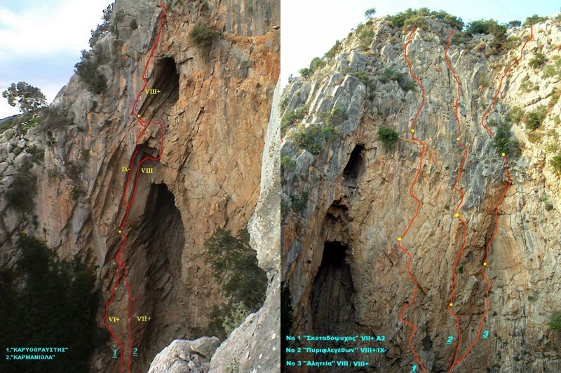

# Πόρτες (Νεραϊδότρυπα)

Το πεδίο που μοιάζει να βρίσκεται σε κρατήρα και έχει δυναμικό για μεγάλες και αρνητικές διαδρομές πολλών σχοινιών. Πήρε το όνομά του από το χωριό που βρίσκεται λίγο πιο κάτω. Βρίσκεται κοντά σε μια μικρή εκκλησία και η ύπαρξη του δεν είναι εμφανής από το δρόμο. Οι ντόπιοι το ονομάζουν Νεραϊδότρυπα.

Μέχρι τώρα υπάρχουν 11 διαδρομές σπορ χαρακτήρα, οι 5 από τις οποίες έχουν 35-45 μέτρα ύψος. Υπάρχουν και 6 παραδοσιακές γραμμές στα αριστερά της σπηλιάς. Παρότι οι διαδρομές έχουν καθαριστεί, μπορεί να σπάσουν πιασίματα ή τούφες.

Το μέρος έχει μοναδική ομορφιά. Όμως, είναι ουσιαστικά μια τρύπα στη γη και είναι αρκετά σκοτεινό. Δεν έχει ζώα (γιατί δεν μπορούν να μπουν και να βγουν), μόνο βατράχια όταν βρέχει και κοράκια. Αν είστε κλειστοφοβικοί ίσως να μην είναι το κατάλληλο πεδίο.

Υπάρχουν 4 τομείς. Μόλις κατεβούμε από τη μεταλλική σκάλα, ξεκινώντας από αριστερά είναι με τη σειρά:

1. [Τοίχος πάνω αριστερά](#sec:portes_pano_aristera)
1. [Τοίχος αριστερά - παραδοσιακές](#sec:portes_aristera_trad)
1. [Τοίχος αριστερά - κάτω δεξιά κομμάτι](#sec:portes_aristera)
1. [Τοίχος δεξιά](#sec:portes_dexia), από τη σκάλα βρίσκεται στην απέναντι πλευρά της Νεραϊδότρυπας.


```{.matplotlib preamble=scripts/barchart4.py format=SVG caption="Νεραϊδότρυπα. Αθροιστικό γράφημα όλων των διαθέσιμων βαθμολογιών."}
y = np.array([2,0.1,1,0,1,1,0.1,1,0.1,0.1,1,1,2,2,2,1,2,0.1,0.1,0.1])

plt.bar(x, y, color=colors, width = 0.9)
plt.yticks([0,2,4])
ax = plt.gca()
for label in ax.xaxis.get_ticklabels()[1::2]:
    label.set_visible(False)
```

## Πρόσβαση

Η πρόσβαση στη Νεραϊδότρυπα γίνεται ακολουθώντας την Εθνική Οδό Πατρών - Πύργου. Στο 15ο χλμ. της εθνικής στρίβεετε αριστερά προς τη βιομηχανική περιοχή και ακολουθείτε το δρόμο προς το Σαντομέρι. Μέχρι τα Πηγάδια είναι ο ίδιος δρόμος όπως και για το [Χατζούρι]. Στα Πηγάδια συνεχίζετε προς το Σαντομέρι και αφού το προσπεράσετε φτάνετε στο χωριό Πόρτες. Στην έξοδο του χωριού η αριστερή διακλάδωση του δρόμου οδηγεί σε ένα ξωκλήσι. Υπάρχει τσιμεντόδρομος για το ξωκλήσι, αλλά είναι προτιμότερο να αφήσετε το αυτοκίνητο κάτω και να ανεβείτε με τα πόδια μέχρι το ξωκλήσι. Το άνοιγμα της σπηλιάς είναι ευθεία πάνω από την εκκλησία. Ξεκινώντας από τα αριστερά της εκκλησίας ανεβαίνετε ψηλότερα με κατεύθυνση προς τον κόκκινο βράχο. Το άνοιγμα θα φανεί όταν είστε αρκετά κοντά. Στην είσοδο της σπηλιάς υπάρχει μεταλλική σκάλα. Το μονοπάτι είναι περίπου 10 λεπτά.

[](https://www.google.com/maps/dir/%CE%A0%CE%AC%CF%84%CF%81%CE%B1/37.9390693,21.5751696/@38.1162473,21.5157089,10.71z/data=!4m9!4m8!1m5!1m1!1s0x135e3599a524ed2d:0x400bd2ce2b98ca0!2m2!1d21.734574!2d38.2466395!1m0!3e0?entry=ttu)

## Συνθήκες
<div class="conditions">

Τα πεδία βρίσκονται μέσα σε μια τρύπα και είναι αρκετά σκιερά. Ο [τοίχος πάνω αριστερά](#sec:portes_pano_aristera) έχει ανατολικό προσανατολισμό. Ο [τοίχος αριστερά - παραδοσιακές](#sec:portes_aristera_trad) και ο [τοίχος αριστερά - κάτω δεξιά κομμάτι](#sec:portes_aristera) κυρίως νότιοι. Ο [τοίχος δεξιά](#sec:portes_dexia) βρίσκεται περίπου απέναντι από τη μεταλλική σκάλα. Οι διαδρομές στα δύο τελευταία πεδία είναι αρνητικές και κάπως προστατευμένες από τη βροχή.

<div class="meteoblue">

<iframe src="https://www.meteoblue.com/el/%CE%BA%CE%B1%CE%B9%CF%81%CF%8C%CF%82/widget/daily/%ce%a0%cf%8c%cf%81%cf%84%ce%b5%cf%82_%ce%95%ce%bb%ce%bb%ce%ac%ce%b4%ce%b1_254852?geoloc=fixed&days=4&tempunit=CELSIUS&windunit=KILOMETER_PER_HOUR&precipunit=MILLIMETER&coloured=coloured&pictoicon=0&pictoicon=1&maxtemperature=0&maxtemperature=1&mintemperature=0&mintemperature=1&windspeed=0&windspeed=1&windgust=0&winddirection=0&winddirection=1&uv=0&humidity=0&humidity=1&precipitation=0&precipitation=1&precipitationprobability=0&precipitationprobability=1&spot=0&pressure=0&layout=light"  frameborder="0" scrolling="NO" allowtransparency="true" sandbox="allow-same-origin allow-scripts allow-popups allow-popups-to-escape-sandbox" style="width: 216px; height: 320px"></iframe><div><!-- DO NOT REMOVE THIS LINK --><a href="https://www.meteoblue.com/el/%CE%BA%CE%B1%CE%B9%CF%81%CF%8C%CF%82/%CE%B5%CE%B2%CE%B4%CE%BF%CE%BC%CE%AC%CE%B4%CE%B1/%ce%a0%cf%8c%cf%81%cf%84%ce%b5%cf%82_%ce%95%ce%bb%ce%bb%ce%ac%ce%b4%ce%b1_254852?utm_source=weather_widget&utm_medium=linkus&utm_content=daily&utm_campaign=Weather%2BWidget" target="_blank" rel="noopener">meteoblue</a></div>

</div>
</div>

## Τοίχος πάνω αριστερά  {#sec:portes_pano_aristera}

Μόλις κατεβείτε από την είσοδο της σπηλιάς, είναι το πρώτο κομμάτι που συναντάτε στα αριστερά. Έχει κυρίως εύκολες διαδρομές, αλλά δεν σκαρφαλώνονται συχνά και γεμίζουν φυτά και χώματα. Επίσης κάποιες χρειάζονται καθάρισμα από ύποπτα κομμάτια βράχου.

*(από τα αριστερά προς τα δεξιά)*

|     |  Όνομα          | Βαθμός | Ύψ. | Χαράκτης
|-|-|-|-|-|
| 1. | Φάρος         | VI+ | 40μ | Καγιαυτάκης (trad)
| 2. | Κέρβερος      | 5b  | 20μ | Καγιαυτάκης
| 3. | Δηλητήριο     | 5b  | 25μ | Καγιαυτάκης
| 4. | Απόγνωση      | 6b+ | 27μ | Καγιαυτάκης
| 5. | Ονειροπαγίδα  | 6a  | 30μ | Καγιαυτάκης
| 6. | Λιγοψυχία     | 6b  | 36μ | Καγιαυτάκης
| 7. | Βαρύσνικοφ    | VI+ | 35μ | Καγιαυτάκης (trad)

```{.matplotlib preamble=scripts/barchart4.py format=SVG caption="Τοίχος πάνω αριστερά. Αθροιστικό γράφημα των διαθέσιμων βαθμολογιών." label=lstpreprocess}
y = np.array([2,0,1,0,1,1,0.1,0.1,0.1,0.1,0.1,0.1,0.1,0.1,0.1,0.1,0.1,0.1,0.1,0.1])

plt.bar(x, y, color=colors, width = 0.9)
plt.yticks([0,2,4])
ax = plt.gca()
for label in ax.xaxis.get_ticklabels()[1::2]:
    label.set_visible(False)
```

## Τοίχος αριστερά - παραδοσιακές {#sec:portes_aristera_trad}

{width="100%"}

|     |  Όνομα          | Βαθμός | Ύψ. | Χαράκτης
|-|-|-|-|-|
| 1. |Kαρυοθραύστης  | VII-           | ?   | Τορέλλι
|    |   2η σχοινιά  | IX-            | ?   | Τορέλλι    
| 2. |Kαρμανιόλα     | VIII-          | ?   | Τορέλλι    
|    |   2η σχοινιά  | VIII+          | ?   | Τορέλλι    
| 3. |Oσμή θανάτου   | project        | ?   | Τορέλλι    
|    |   2η σχοινιά  | VIII+          | ?   | Τορέλλι    
| 4. |Σκοταδόψυχος   | (ασφ. 0/0/6/2) |     |                 
|    |   1η σχοινιά  | IV             | 35μ | Τορέλλι    
|    |   2η σχοινιά  | VIII-          | 40μ | Τορέλλι    
|    |   3η σχοινιά  | VII(6A1)       | 40μ | Τορέλλι    
|    |   4η σχοινιά  | VIII-          | 40μ | Τορέλλι    
| 5. |Πυριφλεγέθων   | IV             | ?   | Τορέλλι    
|    |   2η σχοινιά  | IX-            | ?   | Τορέλλι    
| 6. |Αλητεία        | VI             | ?   | Τορέλλι    
|    |   2η σχοινιά  | VIII+          | ?   | Τορέλλι    
|    |   3η σχοινιά  | VI-            | ?   | Τορέλλι    

## Τοίχος αριστερά - κάτω δεξιά κομμάτι {#sec:portes_aristera}

|     |  Όνομα          | Βαθμός | Ύψ. | Χαράκτης
|-|-|-|-|-|
| 1. | Μελλοθάνατοι | 7b+      |15μ | Τορέλλι    
| 2. | Ζόμπι        | 7b(?)    |15μ | Τορέλλι    
| 3. | Φωτοφοβία    | 8b       |20μ | Θανόπουλος
| 4. | ?            | ??       |40μ | Τορέλλι
| 5. | Χτικιό       | ημιτελής |    | Θανόπουλος

```{.matplotlib preamble=scripts/barchart4.py format=SVG caption="Τοίχος αριστερά - κάτω δεξιά κομμάτι. Αθροιστικό γράφημα των διαθέσιμων βαθμολογιών." label=lstpreprocess}
y = np.array([0.1,0.1,0.1,0.1,0.1,0.1,0.1,0.1,0.1,0.1,1,1,0.1,0.1,0.1,0.1,1,0.1,0.1,0.1])

plt.bar(x, y, color=colors, width = 0.9)
plt.yticks([0,2,4])
ax = plt.gca()
for label in ax.xaxis.get_ticklabels()[1::2]:
    label.set_visible(False)
```

## Τοίχος δεξιά {#sec:portes_dexia}

|     |  Όνομα          | Βαθμός | Ύψ. | Χαράκτης
|-|-|-|-|-|
| 1.  | Enter the Dragon   | 7c  | 30μ | Θανόπουλος
| 2α. | Μικρός Άδης (?)    | 7c+ | 25μ | Τορέλλι
| 2β. | Άδης               | 8a+ | 40μ | Τορέλλι    
| 3.  | Έρεβος             | 8a  | 40μ | Τορέλλι    
| 4.  | Ζώνη του Λυκόφωτος | 8b  | 45μ | Θανόπουλος    
| 5.  | Τροχιά διαφυγής    | 8a  | 36μ | Θανόπουλος    
| 6.  | ?                  | 7c+ | 33μ | Θανόπουλος    
| 7.  | Γολιάθ - 1ο ρελέ   | 6c+ | 15μ | Θανόπουλος
| 7β. | Γολιάθ             | 7c  | 33μ | Τορέλλι

*Η Γολιάθ έχει ένα ρελέ στα 15μ για το πρώτο πιο εύκολο κομμάτι της διαδρομής.*

```{.matplotlib preamble=scripts/barchart4.py format=SVG caption="Τοίχος δεξιά. Αθροιστικό γράφημα των διαθέσιμων βαθμολογιών." label=lstpreprocess}
y = np.array([0.1,0.1,0.1,0.1,0.1,0.1,0.1,1,0.1,0.1,0.1,0.1,2,2,2,1,1,0.1,0.1,0.1])

plt.bar(x, y, color=colors, width = 0.9)
plt.yticks([0,2,4])
ax = plt.gca()
for label in ax.xaxis.get_ticklabels()[1::2]:
    label.set_visible(False)
```
