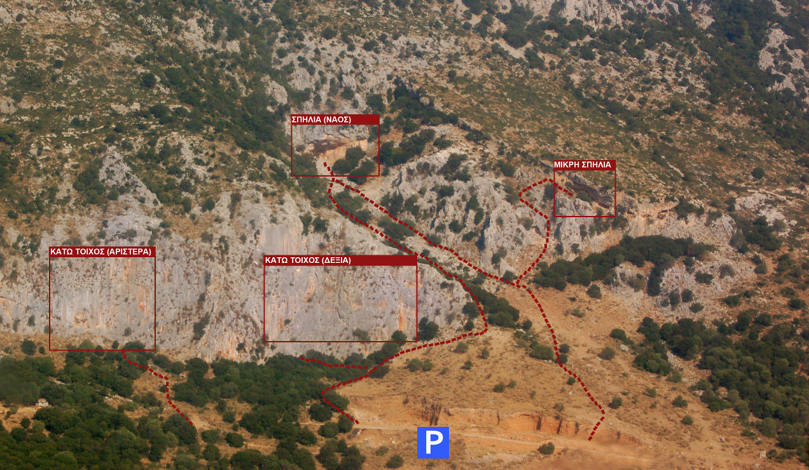
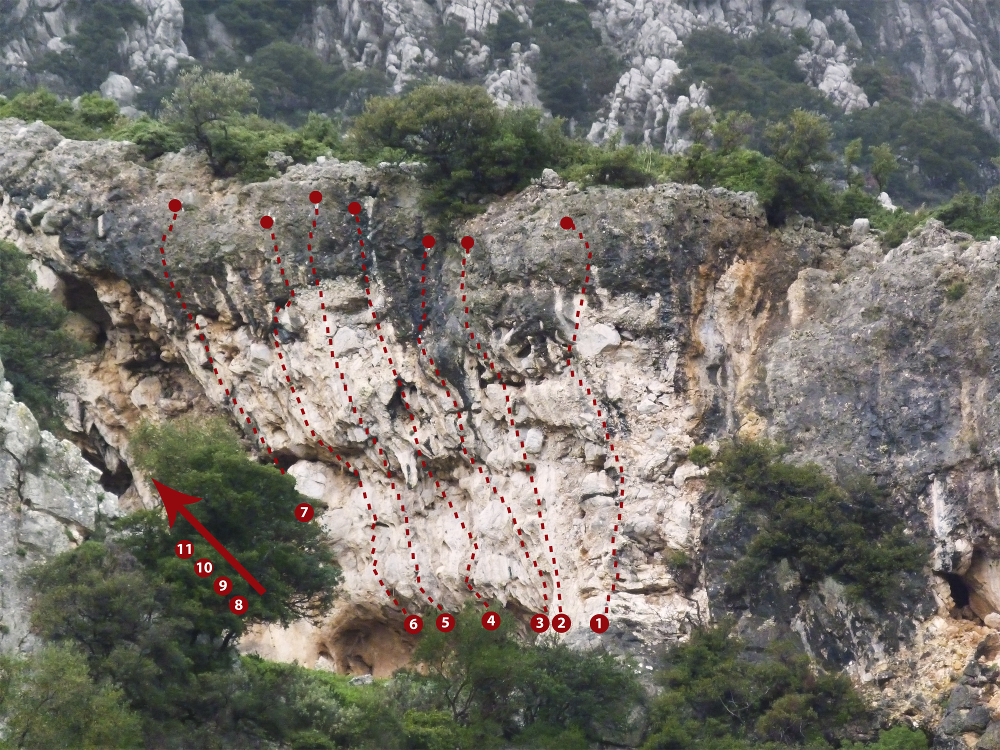

# Χατζούρι

Το Χατζούρι είναι ένα από τα δημοφιλή πεδία της περιοχής. Είναι γνωστό τόσο για τις πολλές διαδρομές μεγάλης δυσκολίας στη σπηλιά όσο και για τον εύκολα προσβάσιμο και ψηλό κάτω τοίχο.

Τα πεδία έχουν κυρίως ανατολικό προσανατολισμό. 

Υπάρχουν τρεις τομείς:

1. [Κάτω τοίχος](#sec:chatzouri_kato_toixos). Ο κάτω τοίχος είναι ο πιο εύκολα προσβάσιμο πεδίο στο Χατζούρι. Ο αριστερός του τομέας έχει ψηλές και ευχάριστες εύκολες διαδρομές.  
1. [Σπηλιά (ναός)](#sec:chatzouri_spilia). Η σπηλιά είναι γνωστή για τις πολλές διαδρομές μεγάλης δυσκολίας.
1. [Μικρή σπηλιά](#sec:chatzouri_mikri_spilia). Το πεδίο στη μικρή σπηλιά ανοίχτηκε το Φεβρουάριο του 2015.

{width=100%}  


```{.matplotlib preamble=scripts/barchart8.py format=SVG caption="Χατζούρι. Αθροιστικό γράφημα όλων των διαθέσιμων βαθμολογιών." label=lstpreprocess}
y = np.array([0.1,0.1,1,1,1,4,2,2,2,4,3,7,5,5,2,6,2,7,4,0.1])

plt.bar(x, y, color=colors, width = 0.9)
plt.yticks([0,2,4,6,8])
ax = plt.gca()
for label in ax.xaxis.get_ticklabels()[1::2]:
    label.set_visible(False)
```

## Πρόσβαση

Το Χατζούρι απέχει περίπου 50 λεπτά από την Πάτρα σε επαρχιακό ασφαλτοστρωμένο δρόμο.

[](https://www.google.com/maps/dir/%CE%A0%CE%AC%CF%84%CF%81%CE%B1,+%CE%95%CE%BB%CE%BB%CE%AC%CE%B4%CE%B1/37.9640271,21.5837692/@38.1357807,21.5266121,11z/data=!4m9!4m8!1m5!1m1!1s0x135e3599a524ed2d:0x400bd2ce2b98ca0!2m2!1d21.734574!2d38.2466395!1m0!3e0?hl=el&entry=ttu)

## Συνθήκες
<div class="conditions">

Τα πεδία έχουν κυρίως ανατολικό προσανατολισμό. Η καλύτερη περίοδος για αναρρίχηση είναι από το φθινόπωρο μέχρι τις αρχές του καλοκαιριού.

<div class="meteoblue">

<iframe src="https://www.meteoblue.com/el/%CE%BA%CE%B1%CE%B9%CF%81%CF%8C%CF%82/widget/daily/charavg%c3%ad_%ce%95%ce%bb%ce%bb%ce%ac%ce%b4%ce%b1_260070?geoloc=fixed&days=4&tempunit=CELSIUS&windunit=KILOMETER_PER_HOUR&precipunit=MILLIMETER&coloured=coloured&pictoicon=0&pictoicon=1&maxtemperature=0&maxtemperature=1&mintemperature=0&mintemperature=1&windspeed=0&windspeed=1&windgust=0&winddirection=0&winddirection=1&uv=0&humidity=0&humidity=1&precipitation=0&precipitation=1&precipitationprobability=0&precipitationprobability=1&spot=0&pressure=0&layout=light"  frameborder="0" scrolling="NO" allowtransparency="true" sandbox="allow-same-origin allow-scripts allow-popups allow-popups-to-escape-sandbox" style="width: 216px; height: 320px"></iframe><div><!-- DO NOT REMOVE THIS LINK --><a href="https://www.meteoblue.com/el/%CE%BA%CE%B1%CE%B9%CF%81%CF%8C%CF%82/%CE%B5%CE%B2%CE%B4%CE%BF%CE%BC%CE%AC%CE%B4%CE%B1/charavg%c3%ad_%ce%95%ce%bb%ce%bb%ce%ac%ce%b4%ce%b1_260070?utm_source=weather_widget&utm_medium=linkus&utm_content=daily&utm_campaign=Weather%2BWidget" target="_blank" rel="noopener">meteoblue</a></div>

</div>
</div>

## Χατζούρι - Κάτω τοίχος {#sec:chatzouri_kato_toixos}

### Αριστερά

|     |  Όνομα          | Βαθμός | Ύψ. | Χαράκτης
|-|-|-|-|-|
| 1.  | Το κράξιμο          | 7b+ | 30m | Τορέλλι
| 2.  | Ντιζελοκίνητος      | 7c  | 30m | Τορέλλι
| 3.  | Βρωμοχορτο          | 7b  | 35m | Τορέλλι
| 4.  | Ladybird spider     | 7c+ | 35m | Τορέλλι
| 5.  | Εκκρεμότητα         | 7c  | 35m | Τορέλλι
| 6.  | Τα νύχια του καγιάκ | 7a  | 35m | Τορέλλι
| 7.  | Νωνταρίνος          | 6b+ | 35m | Καρύμπαλης
| 8.  | Εγκέλαδος           | 6c  | 35m | Σωτηρόπουλος
| 9.  | Φραγκουλέιτορ       | 6b+ | 35m | Καρύμπαλης
| 10. | Ταρίφας             | 6a+ | 35m | Καρύμπαλης
| 11. | Νήμα της στάθμης    | 6a  | 35m | Καρύμπαλης
| 12. | Προβοσκίδα          | 6b  | 35m | 
| 13. | Βυσματίας           | 7a  | 35m | Τορέλλι

```{.matplotlib preamble=scripts/barchart4.py format=SVG caption="Χατζούρι - Κάτω τοίχος αριστερά. Αθροιστικό γράφημα όλων των διαθέσιμων βαθμολογιών." label=lstpreprocess}
y = np.array([0.1,0.1,1,1,1,2,1,0.1,1,1,1,1,2,1,0.1,0.1,0.1,0.1,0.1,0.1])

plt.bar(x, y, color=colors, width = 0.9)
plt.yticks([0,2,4])
ax = plt.gca()
for label in ax.xaxis.get_ticklabels()[1::2]:
    label.set_visible(False)
```

### Δεξιά

|     |  Όνομα          | Βαθμός | Ύψ. | Χαράκτης
|-|-|-|-|-|
|1.  | Τρεις μάγοι      | V/V+/VI    | 80μ | Πιλάλης/Σωτηράκης  |
|2.  | Flash of a blade | 7b+/7c     | 45μ | Θανόπουλος  |
|3.  | Δράκος           | VII+/VIII+ | 50μ | Τορέλλι  |
|4.  | Εκπαιδευτική     | VI         | 25μ | Τορέλλι  |
|5.  | Εκπαιδευτική     | V          | 25μ | Τορέλλι  |
|6.  | Εκπαιδευτική     | VII        | 15μ | Τορέλλι  |
|7.  | Σχισμή           | VI         | 25μ | Τορέλλι  |
|8.  | Βαγγελουβήματα   | V          | 25μ | Τορέλλι  |
|9.  | Φουρτούνα        | VII        | 15μ | Πιλάλης  |
|10. | Σερσέγκι         | 7a (mixed) | 42μ | Τορέλλι  |
|11. | Σφήκα            | 6c         | 42μ | Τορέλλι  |
|12. | Τριτσιμπήδας     | 6b+        | 35μ | Τορέλλι  |
|13. | Αλεπού           | 7b+        | 35μ | Τορέλλι  |

```{.matplotlib preamble=scripts/barchart4.py format=SVG caption="Χατζούρι - Κάτω τοίχος δεξιά. Αθροιστικό γράφημα όλων των διαθέσιμων βαθμολογιών." label=lstpreprocess}
y = np.array([0.1,0.1,0.1,0.1,0.1,1,1,0.1,0.1,0.1,0.1,2,0.1,0.1,0.1,0.1,0.1,0.1,0.1,0.1])

plt.bar(x, y, color=colors, width = 0.9)
plt.yticks([0,2,4])
ax = plt.gca()
for label in ax.xaxis.get_ticklabels()[1::2]:
    label.set_visible(False)
```
<!-- 
```{.matplotlib preamble=scripts/barchart4_uiaa.py format=SVG caption="Χατζούρι - Κάτω τοίχος δεξιά. Αθροιστικό γράφημα όλων των διαθέσιμων βαθμολογιών παραδοσιακής αναρρίχησης." label=lstpreprocess}
y = np.array([0.1,0.1,0.1,3,1,0.1,3,1,0.1,2,1,0.1,0.1,1,0.1,0.1,0.1,0.1,0.1,0.1])

plt.bar(x, y, color=colors, width = 0.9)
plt.yticks([0,2,4])
ax = plt.gca()
for label in ax.xaxis.get_ticklabels()[1::2]:
    label.set_visible(False)
``` -->

## Χατζούρι - Σπηλιά {#sec:chatzouri_spilia}

|     |  Όνομα          | Βαθμός | Ύψ. | Χαράκτης
|-|-|-|-|-|
|1.  | Άκρα αριστερά                 | 6c+       | 15m | Θανόπουλος  
|2.  | Via veneto deluxe             | 7c+       | 10m |  
|3.  | Καταραμένο φίδι               | 7a+       | 15m | Τορέλλι  
|4.  | Σαλαμάνδρα                    | 7b+       | 15m | Θανόπουλος  
|5.  | Jihad                         | 8a+       | 12m | Ποταμούσης  
|6.  | Yπερχατζουριακός              | 8c        | 30m | Θανόπουλος  
|7.  | Black Sabbath                 | 8a+       | 12m | Θανόπουλος  
|8.  | Συκοφάντης                    | 7c+       | 20m | Τορέλλι  
|9.  | Συκοφάντης και gentleman      | 8a+       | 10m | Θανόπουλος  
|10. | Tarzan                        | 7b+       | 20m | Θανόπουλος  
|11. | Tarzan and the spider people  | 7c        | 20m |  
|12. | Parallactica                  | 8b+       | 26m | Θανόπουλος  
|13. | Battlestar Galactica          | 8b+       | 22m | Θανόπουλος  
|14. | Galactica                     | 8b        | 20m | Θανόπουλος  
|15. | Courva Perspectiva            | 8b+       | 20m | Ποταμούσης/Τορέλλι  
|16. | Θεία δίκη                     | 8b+       | 17m | Τορέλλι  
|17. | Θεία κάταδίκη                 | (8b+/8c?) | |
|18. | Θεία Όλγα                     | prj       |     | Τορέλλι  
|19. | Θεία τιμωρία                  | 8b+       | 15m | Θανόπουλος  
|20. | Mr. Techno                    | 8a        | 15m | Θανόπουλος  
|21. | Mr. Forte                     | 8a+       | 18m | Τορέλλι  
|22. | Madame Dobrovos               | 8b        | 20m | Θανόπουλος  
|23. | Mr. Forty                     | 8a+       |     | Θανόπουλος  
|24. | Πτερανόδους                   | 8c?       | 16m | Θανόπουλος  
|25. | Super string                  | (8c/+)    | 25m | Θανόπουλος  
|26. | Βεντούζας                     | (8c?)     | 17m | Τορέλλι  
|27. | Χατζουριος ίππος              | 7c+       |     | Θανόπουλος  
|28. | Κώνειο                        | 8b+       |     | Θανόπουλος  
|29. | Αυτοκόλλητος                  | 8a+       | 18m | Τορέλλι  
|30. | Σιδερενια φτέρνα              | 8a        | 15m | Τορέλλι  
|31. | Σκυλομπίχτης                  | 8a        |     | Θανόπουλος  
|32. | Σκυλοπνίκτης                  | 7b+       | 17m | Θανόπουλος  
|33. | Missing blink                 | 7b+       | 20m | Θανόπουλος  
|34. | Missing link                  | 7c        | 25m | Θανόπουλος  
|35. | Νεράιδα                       | 7b+/7c    | 18m | Τορέλλι  
|36. | Baise moi                     | 7c+       | 15m | Θανόπουλος  

Στο δρόμο για την πάνω σπηλιά υπάρχει και η

|     |  Όνομα          | Βαθμός | Ύψ. | Χαράκτης
|-|-|-|-|-|
|1. | Έκφυλη τσαρίνα | 6b+ | 16μ | Θανόπουλος

```{.matplotlib preamble=scripts/barchart8.py format=SVG caption="Χατζούρι. Αθροιστικό γράφημα όλων των διαθέσιμων βαθμολογιών." label=lstpreprocess}
y = np.array([0.1,0.1,0.1,0.1,0.1,1,0.1,1,0.1,1,0.1,4,2,4,2,6,2,7,4,0.1])

plt.bar(x, y, color=colors, width = 0.9)
plt.yticks([0,2,4,6,8])
ax = plt.gca()
for label in ax.xaxis.get_ticklabels()[1::2]:
    label.set_visible(False)
```

## Χατζούρι - Μικρή σπηλιά {#sec:chatzouri_mikri_spilia}

Η μικρή σπηλιά είναι προσβάσιμη από το πάρκινγκ από δύο μονοπάτια.

+ Το πρώτο μονοπάτι (20-25 λεπτά) ακολουθεί το υπάρχον μονοπάτι που καταλήγει στη μεγάλη σπηλιά. Έπειτα συνεχίζετε δεξιά από τη μεγάλη σπηλιά και προς τα κάτω.
+ Το δεύτερο μονοπάτι (15-20 λεπτά) κόβει δεξιά νωρίτερα, περίπου στη μέση του 1ου μονοπατιού.

### Διαδρομές

*(από τα δεξιά)*

|     |  Όνομα          | Βαθμός | Ύψ. | Χαράκτης
|-|-|-|-|-|
| 1.  | Κουφέτο                 | 6c  | A. Lehne
| 2.  | Χατζούριος Κύβος        | 6b+ | Χ. Σιντόρης
| 3.  | Ανθρωποπούλι            | 6c+ | Σ. Παπαδόπουλος
| 4.  | Νεκρομάντης             | 7a  | Σ. Παπαδόπουλος
| 6.  | Αυτοψία                 | 7b  | Σ. Παπαδόπουλος/Χ. Σιντόρης
| 7.  | Ιερέας των Κελτών       | 7a+ | Σ. Παπαδόπουλος
| 8.  | Αταραξία                | 7a+ | A. Lehne
| 9.  | Κάθαρση                 | 7c  | Σ. Παπαδόπουλος
| 10. | Κάθαρση (ext. αριστερά) | 7b+ | A. Lehne
| 11. | Πνεύμα Αντιλογίας       | 7b+ | Σ. Παπαδόπουλος
| 12. | Φύρδην Μίγδην           | 7b  | Σ. Παπαδόπουλος

Όλες οι διαδρομές είναι σπορ και σχετικά κοντές.  

```{.matplotlib preamble=scripts/barchart4.py format=SVG caption="Χατζούρι. Αθροιστικό γράφημα όλων των διαθέσιμων βαθμολογιών." label=lstpreprocess}
y = np.array([0.1,0.1,0.1,0.1,0.1,1,1,1,1,2,2,2,1,0.1,0.1,0.1,0.1,0.1,0.1,0.1])

plt.bar(x, y, color=colors, width = 0.9)
plt.yticks([0,2,4])
ax = plt.gca()
for label in ax.xaxis.get_ticklabels()[1::2]:
    label.set_visible(False)
```

 

### Το πεδίο

Το πεδίο έχει νοτιοανατολικό προσανατολισμό. Ανοίχτηκε το Φεβρουάριο του 2015. Αν και δεν είναι πια πολύ καινούριο, δεν έχει σκαρφαλωθεί πολύ και χρειάζεται προσοχή για πέτρες που μπορούν να ξεκολλήσουν. Λόγω μορφολογίας οι άνεμοι που πνέουν στην κοιλάδα είναι κάπως πιο ενισχυμένοι στη μικρή σπηλιά.
